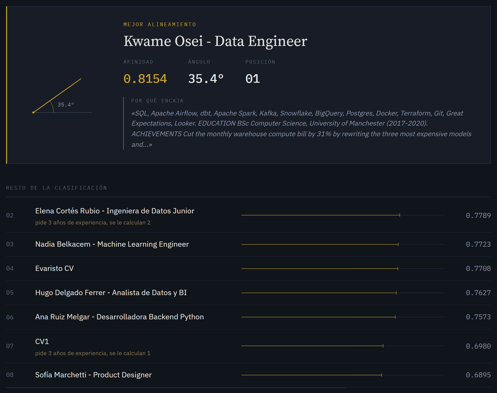
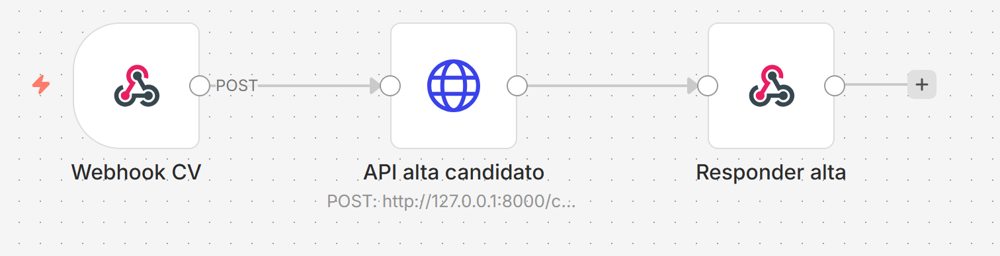
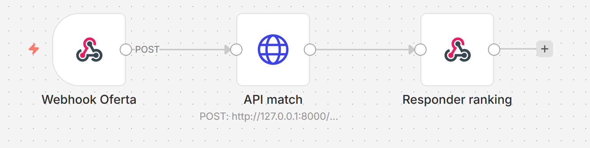

# Recomendador de candidatos

Sistema que recibe CVs en PDF y una descripción de puesto, y devuelve un ranking
de candidatos ordenado por **afinidad semántica** — no por coincidencia de
palabras clave. Un CV que dice *"diseño de pipelines ETL"* puntúa alto frente a
una oferta que pide *"data engineering"* aunque no compartan ni una palabra.

Todo corre en local: el modelo de embeddings, la base de datos y el cálculo de
similitud. Sin APIs de pago ni servicios cloud.

---

## Resultado de ejemplo

Dieciocho candidatos frente a seis ofertas redactadas con el formato y el nivel
de detalle de una oferta real, requisitos incluidos. Dieciséis candidatos son
perfiles ficticios generados para la demo y sí están en el repositorio; los otros
dos son CVs reales con datos personales y **quedan excluidos por `.gitignore`** —
por eso aparecen aquí como `CV1` y `Evaristo CV`. Todos rondan los 2.500-3.500
caracteres, la longitud de un CV real de verdad.

Los cinco primeros de cada oferta, sin tocar nada entre ejecuciones. `cos` es la
similitud coseno pura y `adj` la puntuación tras descontar los requisitos que el
candidato no cumple:

| # | Oferta backend Python sénior *(5 años, Grado, B2)* | `cos` | `adj` |
|---|---|---|---|
| 1 | **Ana Ruiz** — Backend Python | `0.8989` | `0.8989` |
| 2 | Nadia Belkacem — ML Engineer | `0.7775` | `0.7775` |
| 3 | Hugo Delgado — Analista BI | `0.7467` | `0.7467` |
| 4 | Sofía Marchetti — Product Designer | `0.7457` | `0.7457` |
| 5 | Kwame Osei — Data Engineer | `0.7271` | `0.7271` |

| # | Oferta data engineer *(3 años, Grado)* | `cos` | `adj` |
|---|---|---|---|
| 1 | **Kwame Osei** — Data Engineer | `0.8154` | `0.8154` |
| 2 | Elena Cortés — Data Eng. **junior** | `0.8289` | `0.7789` ↓ |
| 3 | Nadia Belkacem — ML Engineer | `0.7723` | `0.7723` |
| 4 | Evaristo CV | `0.7708` | `0.7708` |
| 5 | Hugo Delgado — Analista BI | `0.7627` | `0.7627` |

| # | Oferta data scientist NLP *(4 años, Máster, C1)* | `cos` | `adj` |
|---|---|---|---|
| 1 | **Marc Soler** — Data Scientist | `0.8104` | `0.8104` |
| 2 | Nadia Belkacem — ML Engineer | `0.7967` | `0.7967` |
| 3 | Sofía Marchetti — Product Designer | `0.7764` | `0.7764` |
| 4 | Hugo Delgado — Analista BI | `0.7455` | `0.7155` ↓ |
| 5 | Ana Ruiz — Backend Python | `0.7237` | `0.6837` ↓ |

| # | Oferta frontend React *(sin requisitos)* | `cos` | `adj` |
|---|---|---|---|
| 1 | **Lucía Fernández** — Frontend | `0.8273` | `0.8273` |
| 2 | Sofía Marchetti — Product Designer | `0.7996` | `0.7996` |
| 3 | Ana Ruiz — Backend Python | `0.7493` | `0.7493` |
| 4 | Nadia Belkacem — ML Engineer | `0.7472` | `0.7472` |
| 5 | CV1 | `0.7061` | `0.7061` |

| # | Oferta ML engineer *(en inglés; 3 años, Grado, C1)* | `cos` | `adj` |
|---|---|---|---|
| 1 | **Nadia Belkacem** — ML Engineer | `0.7523` | `0.7523` |
| 2 | Ana Ruiz — Backend Python | `0.6732` | `0.6732` |
| 3 | Kwame Osei — Data Engineer | `0.6713` | `0.6713` |
| 4 | Priya Raghunathan — Cloud Architect | `0.6204` | `0.6204` |
| 5 | Sofía Marchetti — Product Designer | `0.6070` | `0.6070` |

Cinco lecturas de estas tablas:

**Acierta el primero en las seis ofertas.** El ganador es en todos los casos el
perfil de la familia correcta, y el segundo puesto también es defendible — un
product designer detrás de una frontend, un ML engineer detrás de un data
scientist.

**El caso que justifica todo el filtro es el segundo.** Frente a la oferta de
data engineer, quien gana por similitud coseno **no es el data engineer**: es
Elena Cortés, la ingeniera de datos *junior*, con `0.8289` frente a los `0.8154`
de Kwame Osei. Y es un resultado correcto desde el punto de vista semántico —
su CV va exactamente del tema. Lo que el coseno no puede ver es que la oferta
pide tres años y ella tiene dos, porque en el espacio de los embeddings «dos
años» y «tres años» apuntan casi al mismo sitio. El descuento de `0.05` la deja
segunda y explica por qué: *«pide 3 años de experiencia, se le calculan 2»*.

**Distingue familias que se solapan.** El conjunto incluye a propósito data
engineer, data analyst, data scientist y ML engineer, que comparten vocabulario.
Aun así, la oferta de NLP pone arriba al data scientist y al ML engineer, y la de
plataforma de datos al data engineer y a la junior del mismo campo. No está
agrupando por "temática de datos", está separando dentro de ella.

**El cruce de idiomas funciona.** La quinta oferta está escrita en inglés,
requisitos incluidos (`At least 3 years`, `Bachelor's degree`), y los CVs en
español compiten de tú a tú: gana un CV en inglés, pero el segundo y el tercero
están en español. El extractor de requisitos también entiende las dos formas.

**Dice por qué encaja, no solo cuánto.** Cada CV se guarda además troceado en
fragmentos, y el sistema señala cuál de ellos es el más afín a la oferta. El
ranking muestra ese extracto junto al primer candidato, así que se puede
comprobar el resultado en dos segundos en lugar de creerse el número. El
fragmento no interviene en la puntuación — ver más abajo por qué.

**Y el punto débil, que se deja a la vista.** Sofía Marchetti, product designer,
se cuela en el tercer y cuarto puesto de varias ofertas puramente técnicas. Su CV
habla de producto, usuarios, accesibilidad e iteración, vocabulario que aparece
en casi cualquier oferta de software. La causa está explicada abajo: promediar
fragmentos empuja todo documento largo hacia el centro del espacio semántico, y
en la zona media de la tabla las diferencias se comprimen hasta volverse ruido.
El primer puesto es fiable; el undécimo no lo es. El filtro de requisitos no
arregla esto, porque el problema no es de idoneidad sino de resolución del
coseno: ninguna de esas ofertas exige un requisito que ella incumpla.

---

## El filtro de requisitos duros

La similitud coseno mide **de qué va un CV**, no **si el candidato sirve**. En el
espacio de los embeddings «un año de experiencia» y «ocho años» son vectores casi
idénticos: los embeddings representan significado, no cantidad. Lo mismo pasa con
la titulación exigida y con el nivel de idioma.

Por eso, antes de ordenar, el sistema lee los requisitos que la oferta declara y
lo que el CV acredita, y descuenta la diferencia:

| Criterio | Penalización | Tope |
|---|---|---|
| Años de experiencia | `0.05` por año que falta | `0.20` |
| Titulación | `0.04` por nivel que falta | `0.08` |
| Nivel de inglés | `0.03` por nivel MCER que falta | `0.09` |

Los años pesan más que los otros dos juntos, y es deliberado: son el requisito
con el que de verdad se descarta. Las constantes están calibradas contra la
escala real de puntuaciones de este corpus —donde la zona media se comprime por
debajo de `0.02`— para que un requisito de experiencia mande sobre la afinidad
temática y no al revés. Si se cambiara el modelo de embeddings habría que
remedirlas.

### Tres estados, no dos

La decisión central del diseño es que un criterio tiene **tres** resultados
posibles, no dos: *cumple*, *no cumple* y **no se sabe**. La extracción falla a
veces, y confundir «no se pudo leer» con «no cumple» castigaría al candidato por
un fallo del programa.

- La oferta **no lo pide** → no se filtra por ese criterio.
- El CV **no lo declara** → no se penaliza. El sistema calla en vez de inventar.
- Ambos datos existen y el candidato se queda corto → penaliza, y **dice por
  qué**: *«pide inglés C1, acredita B2»*.

Se descartó excluir del ranking a quien no cumple. Borrar a alguien por un fallo
de extracción es un error que nadie ve; bajarlo con el motivo escrito al lado es
revisable en dos segundos.

La puntuación original **no se modifica**: se añade una ajustada, y las dos
viajan juntas hasta la interfaz. Con un único número ya corregido no se podría
distinguir qué parte es afinidad semántica y qué parte es corrección por
requisitos, que es justo lo que hace el ranking auditable.

### Qué tal lee los CVs

Sobre los 18 CVs indexados (`python medir_extractor.py`):

| Criterio | Extraído | No declarado en el CV |
|---|---|---|
| Años de experiencia | 17 / 18 | 1 |
| Titulación | 16 / 18 | 2 |
| Nivel de inglés | 17 / 18 | 1 |

Los años salen de **unir los rangos de fechas** de la sección de experiencia, no
de sumarlos: `2018-2019`, `2019-2021` y `2021-2026` son ocho años, no diez,
porque el año de salida de un empleo es el de entrada del siguiente. Y salen de
la sección de experiencia y no del documento entero, porque el `(2014-2018)` de
una carrera no son años trabajados.

Solo si no hay ningún rango se recurre a frases del tipo «siete años
gestionando». Ese orden importa: un CV del corpus menciona *«la migración de un
monolito de siete años»*, y una búsqueda de frases que fuese primero le asignaría
siete años de experiencia a quien tiene ocho, por un dato que no habla de ella
sino del sistema que migró.

### Qué mejora, medido

El criterio es dónde caen los dos controles negativos —una técnica de RRHH y un
contable sénior— que deberían hundirse frente a cualquier oferta técnica
(`python medir_ranking.py`):

| | Posición media de los controles (de 18) |
|---|---|
| Sin filtro | 15,42 |
| **Con filtro** | **16,08** |

La mejora es real pero modesta, y conviene ser preciso sobre por qué: los
controles negativos ya estaban al fondo, así que quedaba poco margen. **Donde el
filtro se nota de verdad es en la zona alta**, que es la que se mira: es lo que
separa al data engineer sénior de la junior, y ese cambio no aparece en una media
de posiciones.


## Cómo funciona

```
CV.pdf ──► extract_text.py ──► embed_and_store.py ──► MySQL
           (pdfplumber)        (sentence-transformers)  (texto + vector JSON)
                                                            │
oferta ──► embed_and_store.py ──► match.py ────────────────►┤
           (mismo modelo)         (coseno con numpy)         │
                                          │                  │
                                          ▼                  ▼
                                      ranking            tabla matches
```

Cada texto —CV u oferta— se convierte en un vector de 384 dimensiones que
representa su *significado*. Comparar dos textos es entonces medir el ángulo
entre sus vectores:

```python
similitud = dot(a, b) / (norm(a) * norm(b))
```

Se usa el coseno y no la distancia euclídea porque mide **dirección, no
magnitud**. Un CV de tres páginas genera un vector con más "energía" acumulada
que una oferta de diez líneas; con una métrica sensible al tamaño, los CVs largos
ganarían por ser largos y no por ser afines. Al dividir por las dos normas esa
diferencia desaparece y solo queda la pregunta relevante: *hacia dónde apunta
cada texto*.

### Las tres formas de usarlo

El mismo pipeline se consume desde tres sitios distintos, y ninguno reimplementa
lógica. Es la prueba de que la separación por capas es real:

```
terminal ──┐
n8n ───────┼──► api.py ──► extract_text / embed_and_store / match ──► MySQL
Streamlit ─┘
```

---

## Puesta en marcha

```powershell
# 1. Dependencias
python -m venv .venv
.\.venv\Scripts\python.exe -m pip install -r requirements.txt

# 2. Base de datos (MySQL 8 en Docker, local)
copy .env.example .env
docker compose up -d

# 3. Pipeline en Python puro
.\.venv\Scripts\python.exe db_setup.py          # crea el esquema
.\.venv\Scripts\python.exe embed_and_store.py   # indexa los CVs de cvs/
.\.venv\Scripts\python.exe match.py backend_python_senior
```

Eso ya imprime un ranking. Las capas de arriba son opcionales:

```powershell
# Capa HTTP (necesaria para n8n y para Streamlit)
.\.venv\Scripts\python.exe -m uvicorn api:app --host 127.0.0.1 --port 8000

# Vitrina visual (el tema y el bind a localhost salen de .streamlit/config.toml)
.\.venv\Scripts\python.exe -m streamlit run app_streamlit.py

# Orquestación
npx -y n8n
```

Detalles de n8n (importar flujos, publicar, webhooks): [`n8n/README.md`](n8n/README.md).

### Pruebas y diagnóstico

```powershell
.\.venv\Scripts\python.exe -m pytest tests/ -v   # 61 pruebas, ~6 s
```

No necesitan MySQL, ni el modelo cargado, ni ningún servicio: cubren
`requisitos.py`, que es texto entrando y datos saliendo. Esa es la razón de que
viva en un fichero aparte.

Los dos scripts de diagnóstico reproducen las cifras de este README, para que se
puedan comprobar en vez de creerlas:

```powershell
.\.venv\Scripts\python.exe medir_extractor.py   # qué lee el filtro de cada CV
.\.venv\Scripts\python.exe medir_ranking.py     # ranking con filtro y sin él
```

---

## Decisiones y por qué

**Embeddings locales, modelo multilingüe.** `paraphrase-multilingual-MiniLM-L12-v2`
con `sentence-transformers`. Se descartó `all-MiniLM-L6-v2`, que es mejor en
inglés puro, porque los CVs y ofertas mezclan español e inglés y el modelo
monolingüe no alinea bien los dos idiomas en el mismo espacio. Sin APIs externas
(OpenAI, Voyage, Cohere): el proyecto no depende de terceros ni de una tarjeta.

**MySQL y no una base vectorial.** Con dieciocho candidatos, un índice vectorial
no aporta nada: comparar dieciocho vectores de 384 dimensiones es instantáneo. El
embedding se guarda serializado en una columna `JSON` y la similitud se calcula
en Python. Es una decisión de escala, no de desconocimiento — con cientos de
miles de CVs la respuesta correcta sería pgvector o Qdrant, y el cambio afectaría
solo a `match.py`.

**El coseno escrito a mano.** Existe `sklearn.metrics.pairwise.cosine_similarity`
y habría sido una línea. Se escribió con numpy para que la fórmula esté a la
vista y se pueda explicar, que es el objetivo de este proyecto.

**Todo en local, sin cloud.** Decisión deliberada de alcance.

**n8n con `npx` y no en Docker.** Dentro de un contenedor, `localhost` es el
propio contenedor: n8n no alcanzaría ni a la API ni a MySQL sin configurar redes.
Nativo, las piezas comparten `127.0.0.1`.

**Una capa HTTP entre n8n y los scripts.** Los nodos de n8n llaman a `api.py`,
que importa las funciones ya probadas. Borrando `api.py` y `n8n/`, el pipeline
sigue funcionando por terminal exactamente igual.

**Sin autenticación.** Corre en local y no se expone a internet. En un despliegue
real llevaría un token por cabecera. Es una decisión consciente, no un olvido.

---

## Problemas reales que aparecieron

Todos se detectaron midiendo, no leyendo código.

**Una oferta sin requisitos acabó exigiendo un Grado que nunca pidió.** De las
seis ofertas, la de frontend no declara ningún requisito duro: está ahí como
control, porque su ranking tiene que salir idéntico con filtro y sin él. No
salió. El primer puesto cambió de la desarrolladora frontend a una product
designer.

La causa: `Qué ofrecemos` no estaba en la lista de cabeceras reconocidas, así que
no **cerraba** la sección anterior. El texto de beneficios se quedaba dentro de
los requisitos, y la frase *«un equipo de producto donde diseño e **ingeniería**
deciden juntos»* disparaba el detector de titulación. La frontend, que tiene FP,
pagaba `0.04` por una titulación imaginaria.

Reconocer dónde **termina** una sección resultó ser tan importante como reconocer
dónde empieza, y no es evidente hasta que muerde. La oferta de control se ganó el
sitio ella sola: sin ella, el fallo habría pasado por «el ranking ha cambiado un
poco, será el filtro haciendo su trabajo».

**El modelo truncaba el 85% de cada CV en silencio.** MiniLM tiene una ventana de
128 tokens y descarta lo que sobra sin lanzar ningún error. De un CV de tres
páginas solo se comparaban el nombre, el titular y el párrafo de perfil — prosa
genérica que se parece entre todos los candidatos — y quedaba fuera la sección de
tecnologías, que es justo la que distingue un backend de un frontend. El síntoma
medible fue el perfil de RRHH colándose en cuarta posición frente a una oferta de
backend.

*Solución:* `embed()` trocea el documento por frases en fragmentos que caben
enteros en la ventana, embebe cada uno, **normaliza antes de promediar** (sin eso
un fragmento de mayor magnitud arrastra la media por enérgico, no por
representativo) y devuelve el centroide.

*Contrapartida honesta:* promediar convierte el documento en su centroide
temático, así que un CV largo y transversal queda a media distancia de todo y
puntúa medio-alto frente a cualquier oferta. El caso claro es CV1, el documento
más largo del conjunto: por similitud pura queda 2º, 3º, 2º y 6º en ofertas para
las que no es el mejor candidato.

**Y aquí el filtro de requisitos resultó arreglar más de lo que pretendía.** CV1
acredita un año de experiencia, así que en cuanto una oferta pide varios se
desploma:

| Oferta | CV1 sin filtro | CV1 con filtro |
|---|---|---|
| Backend Python sénior *(5 años)* | 2º | **16º** |
| ML engineer *(3 años)* | 2º | **11º** |
| Data scientist NLP *(4 años)* | 6º | **13º** |
| Data engineer *(3 años)* | 3º | **7º** |
| Frontend React *(sin requisitos)* | 5º | 5º |
| Software tools developer *(1 año)* | 1º | **1º** |

Las dos últimas filas son las que dan sentido a las otras cuatro: donde la oferta
no exige nada, CV1 no se mueve; y donde solo pide un año —que sí tiene— se queda
primero. No es que el filtro castigue a los CVs largos, es que la amplitud
temática de CV1 estaba **tapando** una experiencia corta que ninguna cantidad de
similitud coseno podía ver. Es la limitación documentada más arriba, mitigada por
un mecanismo que se diseñó para otra cosa.

**La solución evidente se probó y era peor.** Si promediar diluye al
especialista, lo lógico parece puntuar por el *mejor* fragmento: bastaría con que
una parte del CV respondiera a la oferta. Se implementó y se midió sobre los
dieciocho candidatos y las cuatro ofertas de la primera versión, más cortas y sin
requisitos que las seis actuales. Todas las variantes aciertan al
ganador, así que el criterio decisivo es dónde caen los dos controles negativos,
que deberían hundirse:

| agregación | posición media de los controles (de 18) |
|---|---|
| **promedio** | **16,62** |
| 70% promedio + 30% máximo | 16,12 |
| 50% + 50% | 15,75 |
| 30% + 70% | 15,25 |
| media del top-3 | 14,88 |
| media del top-2 | 14,75 |
| solo el máximo | 13,88 |

La relación es monótona: cuanto más peso al máximo, peor. El motivo es que el
máximo se queda con **un** fragmento, y todo CV tiene alguno genérico —el perfil
de apertura, los datos de disponibilidad— que puntúa tibio contra cualquier
oferta. Al promediar se premia que el documento entero vaya del tema. La
intuición era razonable y los datos la desmienten, así que el promedio se queda.

**Acentos partidos en dos glifos.** Uno de los CVs reales está generado con LaTeX
y no incrusta la letra acentuada, sino la base y el acento por separado. Al
extraer salía `Formacio´n Acade´mica`, `Espan˜a`, `Tecnolog´ıa`. Para el
tokenizador eso no son palabras en español, y se perdía el significado de
secciones enteras. `unicodedata.normalize("NFC")` no basta: son acentos
*espaciadores*, no combinantes, y hay que convertirlos primero. Además el acento
aparece unas veces delante y otras detrás de su letra, según la coordenada X con
la que el PDF dibujó cada glifo.

**Mojibake silencioso por stdin en Windows.** `sys.stdin` se abre con la
codificación del sistema (`cp1252`), así que una oferta en UTF-8 llegada por
tubería se decodificaba mal **sin lanzar ninguna excepción** y cambiaba el orden
del ranking. Importa porque es exactamente como n8n inyecta el texto. Se leen los
bytes crudos y se decodifican a mano.

---

## Limitaciones conocidas

- **Los CVs largos y transversales puntúan alto contra todo.** Explicado arriba.
- **La zona media del ranking no es fiable.** El primer puesto acierta en las
  seis ofertas, pero entre los puestos 8 y 15 las diferencias caen por debajo de
  `0.02` y el orden deja de significar nada. Al alargar los CVs de
  700 a 2.500 caracteres el primer puesto mejoró y la zona media empeoró, que es
  justo lo que predice el efecto centroide. Se descartaron dos explicaciones
  midiendo: no lo causa el texto genérico común a todos los CVs (al eliminarlo,
  el orden apenas se movió) y no lo arregla puntuar por el mejor fragmento (sale
  peor, ver la tabla de arriba).
- **El extractor de requisitos es de expresiones regulares, no semántico.** Sabe
  leer los formatos habituales (`mínimo 5 años`, `3+ años`, `at least 3 years`,
  `Grado en...`, `inglés B2`) y segmenta por cabeceras a partir de una lista de
  rótulos conocidos. Una oferta que titule sus apartados de forma inusual puede
  colar texto en la sección equivocada — es exactamente el fallo que se cuenta
  arriba. El error se degrada hacia el lado seguro: un requisito de menos
  significa no filtrar, y uno de más queda a la vista porque el aviso se muestra.
- **Solo se comparan tres criterios, y de la titulación solo el nivel.** Decidir
  si un «Grado en Matemáticas» vale para una oferta que pide «Grado en
  Informática» es un problema semántico, y para eso ya está el coseno: duplicarlo
  con una lista de sinónimos daría un resultado peor y además invisible. Quedan
  fuera la disponibilidad y la ubicación, que los CVs casi nunca declaran de
  forma comparable.
- **Los requisitos se releen en cada consulta**, no se guardan en la base de
  datos. Con 18 candidatos son unas pocas expresiones regulares y no se nota; con
  miles habría que precalcularlos al indexar.
- **Sin OCR.** Un CV escaneado como imagen no da texto; el sistema lo detecta y
  lo rechaza con un mensaje claro en vez de indexar un candidato vacío.
- **Streamlit no es desplegable tal cual en la nube.** La app consume la API
  local, que a su vez habla con MySQL local. En Streamlit Community Cloud no
  habría nada al otro lado. Desplegarlo exigiría exponer el stack o precalcular
  los datos de demo — y eso reabriría la decisión de "sin cloud".

---

## Estructura

```
extract_text.py       Paso 1 · PDF -> texto limpio (pdfplumber)
db_setup.py           Paso 2 · esquema MySQL y conexión reutilizable
embed_and_store.py    Paso 3 · texto -> vector de 384 dims -> MySQL
match.py              Paso 4 · coseno y ranking
requisitos.py         texto -> años, titulación e inglés (sin dependencias)
api.py                Paso 6 · capa HTTP (FastAPI) que consumen n8n y Streamlit
app_streamlit.py      Paso 7 · vitrina visual
tests/                61 pruebas del extractor de requisitos (pytest)
medir_extractor.py    diagnóstico: qué lee el filtro de cada CV
medir_ranking.py      diagnóstico: ranking con filtro y sin él
n8n/                  flujos exportados + guía de orquestación
cvs/                  CVs en PDF
ofertas/              seis descripciones de puesto en .txt
docs/                 capturas para este README
```

`requisitos.py` no sabe nada de MySQL, de embeddings ni de la interfaz: convierte
cadenas de texto en datos comparables y nada más. Por eso sus 61 pruebas corren
en seis segundos sin levantar ningún servicio, y por eso está en un fichero
aparte en lugar de dentro de `match.py`.

**Esquema de datos:** `candidatos` (clave única por archivo), `puestos` (clave
única por SHA-256 de la descripción) y `matches` (única por par candidato-puesto).
Las tres claves hacen el pipeline idempotente: reprocesar no duplica nada.

---

## Capturas



La oferta pide tres años de experiencia. **Elena Cortés gana por similitud pura**
—su CV va exactamente del tema— pero tiene dos años, así que queda segunda y el
motivo aparece bajo su nombre. Kwame Osei, el data engineer con la experiencia
que se pide, pasa al primer puesto. Debajo, CV1 baja hasta el séptimo por la
misma razón.

El ángulo dibujado a la izquierda no es decoración: **θ = arccos(afinidad)** es
literalmente lo que calcula `match.py`. La regla capilar de cada fila mide la
puntuación en escala absoluta 0-1, sin normalizar al máximo de la lista, porque
normalizar exageraría diferencias que en la zona media son ruido.

Faltan las dos capturas de los flujos de n8n — ver [`docs/README.md`](docs/README.md).
Requieren crear la cuenta de propietario del editor, que pide email y contraseña.
Cuando estén, basta con descomentar este bloque:

<!--
| | |
|---|---|
|  |  |
| Flujo A — alta de candidato | Flujo B — ranking |
-->

